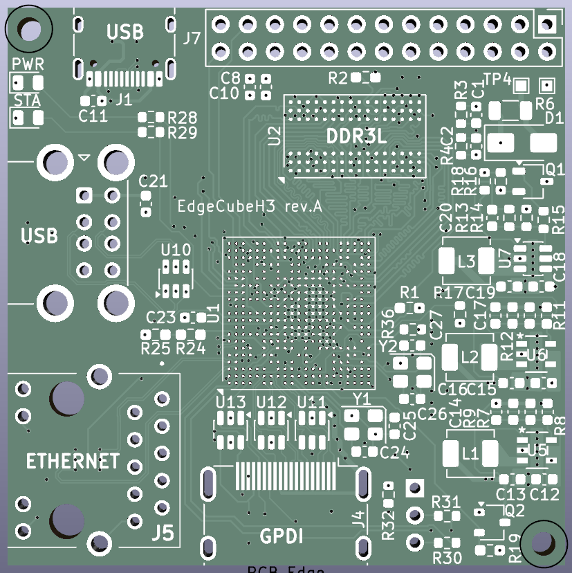
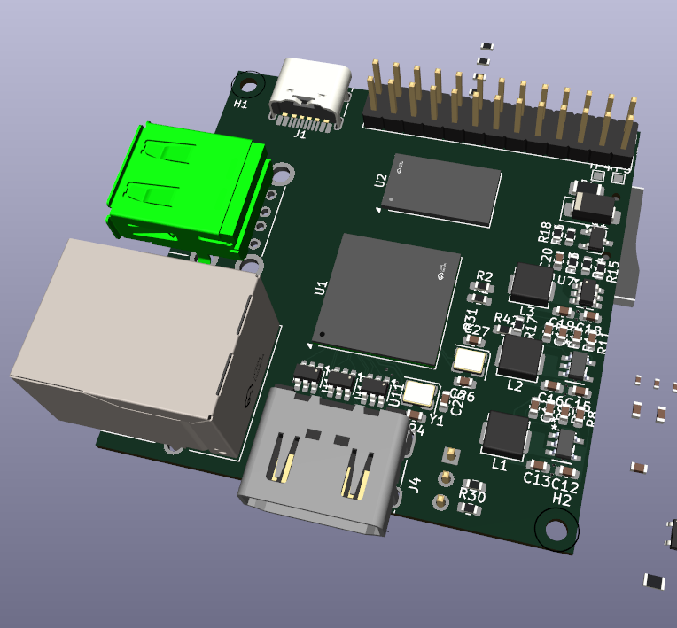

# EdgeCubeH3
Work in proggress

Custom, cheap, simple and hand-solder single-board computer with allwinner H3 CPU. Compatibilie with Orange Pi One OS's likes Armbian.

## Features

- H3 Quad-Core ARM Cortex-A7 @ 1.2GHz CPU
    - Mali400 MP2 OpenGL ES 2.0 GPU
- 512MiB of DDR3L RAM, 16b
- 16MB SPI FLASH (Optional)
- Ethernet PHY, 100Mb/s
- GPDI video out
- USB connectors:
    - 2x USB-A 
    - 1x USB-C
- uSD card slot
- GPIO
- Small format 52x52mm
